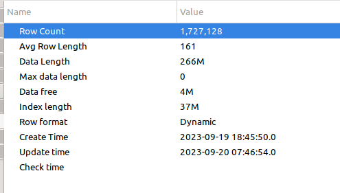
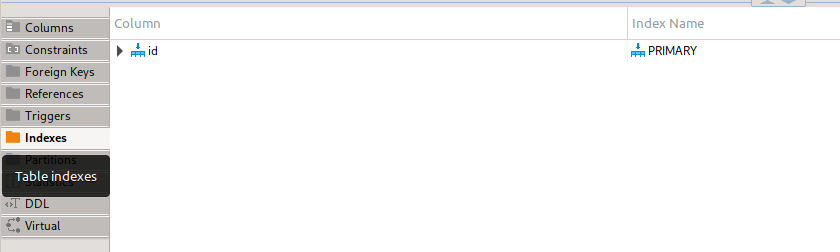
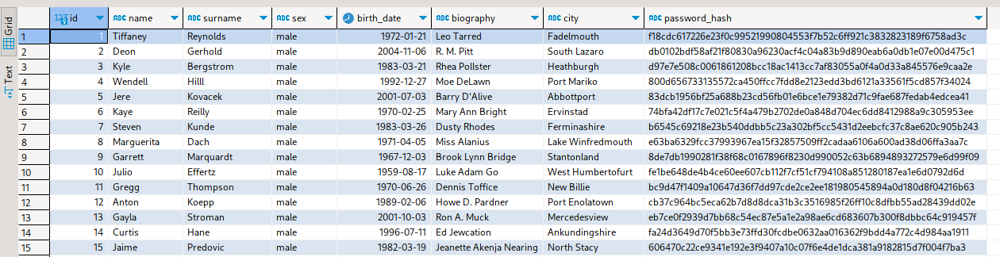

# Тестирование производительности с индексом и без

* [урл апи для теста](http://localhost:8080/swagger-ui/index.html#/user/userSearchGet)
* генерация тестовых данных командой __gradle bootRun --args="--generate_users=1000"__
* [сценарий(jmeter) для создания нагрузки](./search_dos.jmx)

## Состояние бд на начало тестов

## Замер производительности при изначальном состоянии