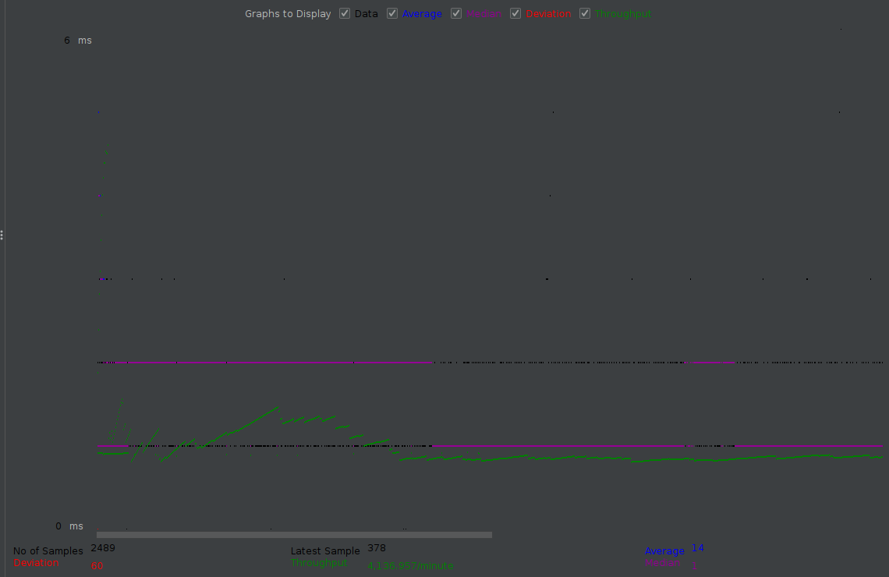
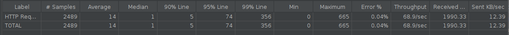

# Тестирование производительности с индексом и без

* [урл апи для теста](http://localhost:8080/swagger-ui/index.html#/user/userSearchGet)
* генерация тестовых данных командой __gradle bootRun --args="--generate_users=1000"__
* [сценарий(jmeter) для создания нагрузки](search_dos.jmx)

## Методология тестировния

* при тестировании приложение, бд и создаваемая нагрузка находятся на 1 машине
* нагрузка создается при помощи приложения jmeter. [сценарий(jmeter) для создания нагрузки](search_dos.jmx)
    * Приложени отправляет запросы на поиск по имени и фамилии, подставляя в запрос рандомную 1 букву (худший вариант
      поиска)
* тестирование проводится в 3 этапа
    * в 1 поток
    * в 10 потоков
    * в 50 потоков
* после проведения пероприятий по оптимизации тесты повторяются

## Состояние бд на начало тестов

## Замер производительности при начальном состоянии

### в 1 поток

### в 10 потоков

### в 50 потоков

## Оптимизация работы БД

`CREATE INDEX users_name_IDX USING BTREE ON hw.users (name);
CREATE INDEX users_surname_IDX USING BTREE ON hw.users (surname);`

В зависимости от условий по которым осуществляется поиск, бд может выбирать между 2-мя индексами. В каких то случаях
будет оптимальнее использовать по имени, а в какихто по фамилии.

## Замер производительности после создания индексов

### в 1 поток

### в 10 потоков

### в 50 потоков

## Сравнение результатов

кроме вариант нагрузки в 1 поток принципиального прироста производительности нет, возможно проблема в запросе (по 1
букве на имя и фамилию, что является худшим случаем поиска)

### 1 поток

### 10 потоков

### 50 потоков

## Изменим характер нагрузки

Изменим план тестирования чтобы в запрос подставлялось от 1 до 4 букв (и в имя и в фамилию). Ипроведем повторно
тестрование с индексом, т.к. при отсутствии индексов план выполнения запроса не зависит от количества букв.

### в 1 поток

### в 10 потоков

### в 50 потоков

## Сравнение результатов

С таким запросом уже видно принципиальный прирост пропускной способности приложения и в некоторых случаях ускорение до
1000 раз

### 1 поток

### 10 потоков

### 50 потоков

