# Тестирование производительности с индексом и без

* [урл апи для теста](http://localhost:8080/swagger-ui/index.html#/user/userSearchGet)
* генерация тестовых данных командой __gradle bootRun --args="--generate_users=1000"__
* [сценарий(jmeter) для создания нагрузки](search_dos.jmx)

## Методология тестировния

* при тестировании приложение, бд и создаваемая нагрузка находятся на 1 машине
* нагрузка создается при помощи приложения jmeter. [сценарий(jmeter) для создания нагрузки](search_dos.jmx)
    * Приложени отправляет запросы на поиск по имени и фамилии, подставляя в запрос рандомную 1 букву (худший вариант
      поиска)
* тестирование проводится в 3 этапа
    * в 1 поток
    * в 10 потоков
    * в 50 потоков
* после проведения пероприятий по оптимизации тесты повторяются
* после каждого замера приложение и бд перезапускаются

## Состояние бд на начало тестов

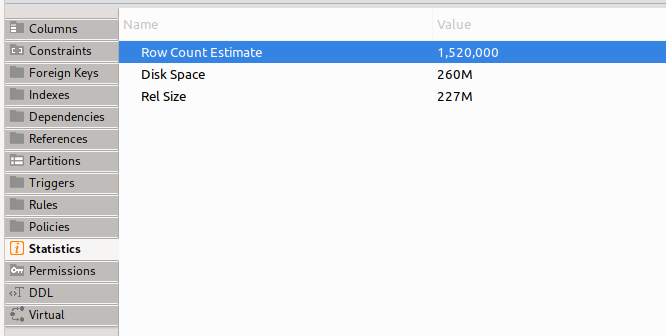
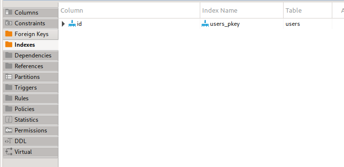
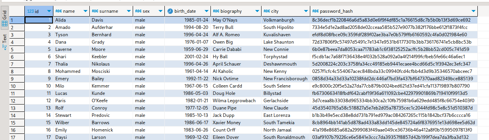

## Замер производительности при начальном состоянии

### в 1 поток

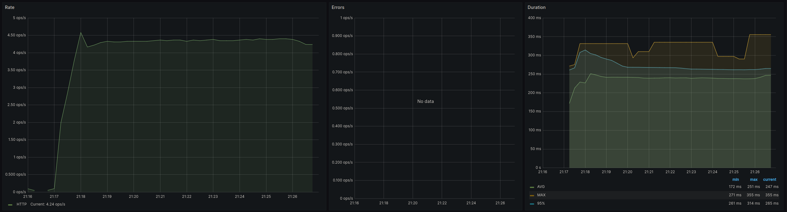
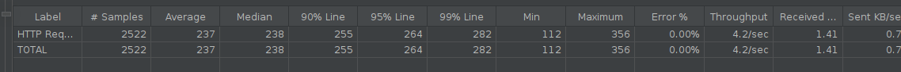

### в 10 потоков

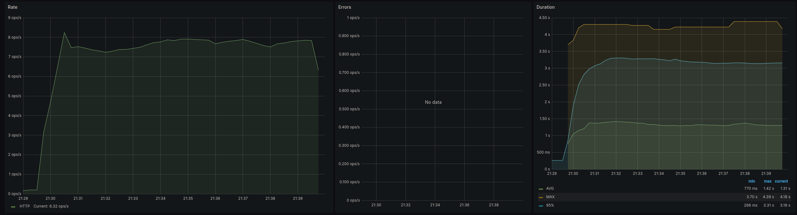
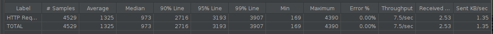

### в 50 потоков

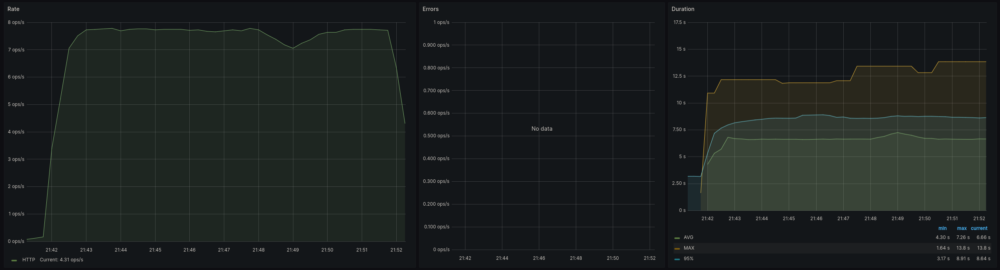
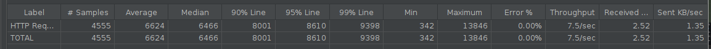

## Оптимизация работы БД

```postgresql
CREATE INDEX users_name_surname_idx ON public.users (lower("name") varchar_pattern_ops,lower(surname) varchar_pattern_ops);
```

опция varchar_pattern_ops нужна для оптимизации индекса под поиск по префиксу, с этой оптимизацией индекс будет
использован для поиска по 2-м полям, без нее индекс не используется.

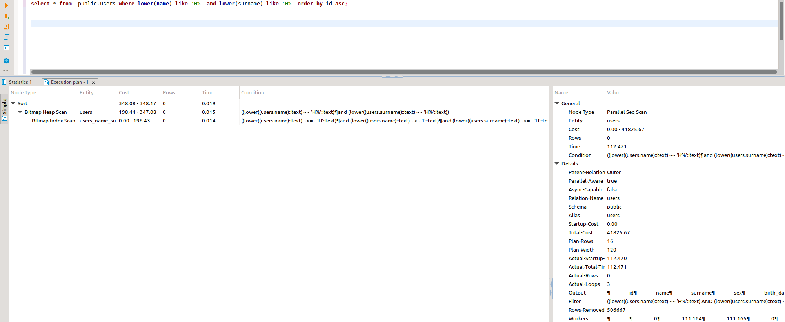

## Замер производительности после создания индексов

### в 1 поток

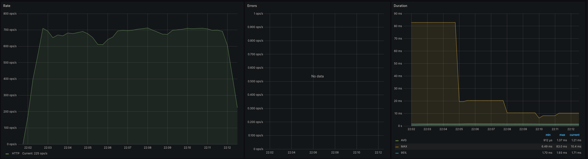
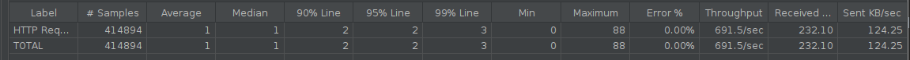

### в 10 потоков

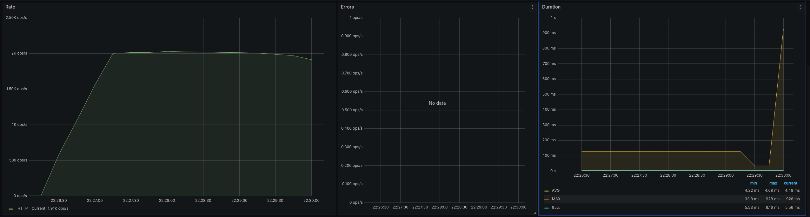


### в 50 потоков

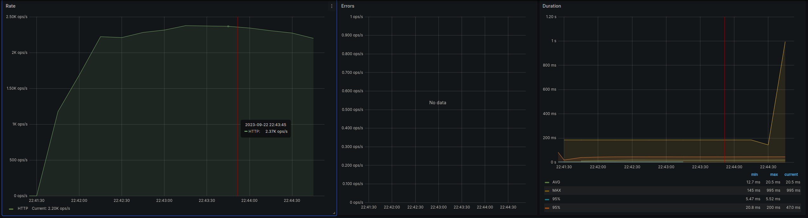
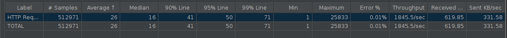

## Сравнение результатов

### 1 поток


### 50 потоков


